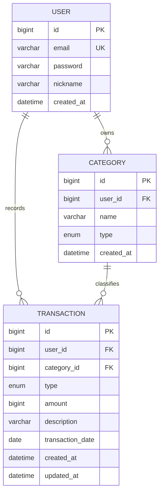

# 💰 머니로그 (MoneyLog)

> 개인이 수입/지출을 기록하고, 카테고리별·월별 통계를 한눈에 보는 가계부 웹 서비스


## 🔗 바로가기

- 🌐 **배포 URL**: http://13.125.251.47:8080 (테스트 계정: `hong@moneylog.com` / `pass1234`)
- 📘 **API 문서(Swagger)**: http://13.125.251.47:8080/swagger-ui/index.html
- 📄 **설계 문서**: [요구사항 정의서](docs/requirements.md) · [ERD](docs/erd.md) · [API 명세서](docs/api-spec.md)
- 📝 **회고**: [docs/retrospective.md](docs/retrospective.md)

---

## 📌 프로젝트 소개

멋쟁이사자처럼 백엔드스쿨 캡스톤 프로젝트입니다. 자바 → 스프링 → 시큐리티 → 프론트 → DevOps로 이어지는 부트캠프 전 과정을
개인 가계부 서비스 하나로 관통해 만들었습니다. 핵심 원칙은 "내 데이터는 나만 접근한다"이며, 도전 과제는 이번 범위에서 제외하고
기본 트랙만 진행했습니다.

## ✨ 주요 기능

- 🔐 회원가입 / 로그인 (JWT, BCrypt)
- 📁 카테고리 관리 (가입 시 기본 시드 + 추가/수정/삭제)
- 💸 거래내역 CRUD (수입/지출 등록·조회·수정·삭제)
- 🔍 월별 목록 조회 + 페이징
- 📊 월별 통계 (총수입/총지출/잔액 + 카테고리별 지출)
- 🛡 본인 데이터만 접근 가능한 인가
- ✅ 입력 검증 + 공통 에러 응답 형식

## 🛠 기술 스택

| 구분 | 기술 |
|---|---|
| Backend | Java 21, Spring Boot 3.4, Spring Web, Spring Data JPA |
| Security | Spring Security, JWT(jjwt), BCrypt |
| DB | H2(로컬), MySQL 8(운영) |
| Docs | springdoc-openapi(Swagger UI) |
| Frontend | HTML/CSS/JavaScript (fetch, localStorage) |
| DevOps | Docker, docker-compose, GitHub Actions, AWS EC2 |

## 🗂 ERD



자세한 컬럼/제약 조건은 [docs/erd.md](docs/erd.md) 참고.

## 🚀 실행 방법

### 1) 로컬 (H2)

IntelliJ에서 `MoneylogApplication`을 실행하거나:

```bash
./gradlew bootRun
```

기본 포트는 8080이고, H2 콘솔은 `/h2-console`, Swagger는 `/swagger-ui/index.html`에서 확인합니다.

### 2) Docker (MySQL 포함)

```bash
docker compose up -d --build
```

앱은 8081 포트, MySQL은 3307 포트로 노출됩니다.

### 3) 프론트

`frontend/login.html`을 VSCode Live Server(또는 http-server)로 열면 됩니다.
`frontend/js/config.js`의 `API_BASE`가 백엔드 주소를 가리킵니다.

## 📋 API 요약

| Method | Path | 설명 |
|---|---|---|
| POST | `/api/auth/signup` | 회원가입 |
| POST | `/api/auth/login` | 로그인 (JWT 발급) |
| GET/POST | `/api/categories` | 카테고리 조회/추가 |
| PUT/DELETE | `/api/categories/{id}` | 카테고리 수정/삭제 |
| GET/POST | `/api/transactions` | 거래내역 조회(필터/페이징)/등록 |
| GET/PUT/DELETE | `/api/transactions/{id}` | 거래 상세/수정/삭제 |
| GET | `/api/statistics/monthly?yearMonth=2026-07` | 월별 통계 |

전체 명세와 요청/응답 예시는 [docs/api-spec.md](docs/api-spec.md) 또는 Swagger 참고.

## 📂 프로젝트 구조

```
src/main/java/org/example/moneylog
├── domain      # 엔티티 (User, Category, Transaction)
├── repository  # JPA Repository
├── service     # 비즈니스 로직
├── controller  # REST API
├── dto         # 요청/응답 DTO, 공통 응답 형식
├── security    # JWT, 인증 필터
├── config      # SecurityConfig, CORS, WebConfig
└── exception   # 커스텀 예외, 전역 예외 처리
```

## 📝 회고

- **Keep**: 일차별 목표를 순서대로 지켜서 5일 안에 기본 완주, 매일 커밋해서 히스토리가 깔끔함
- **Problem**: springdoc 버전 불일치로 Swagger가 403처럼 보였던 문제, EC2 SSH 접속 불가(테더링 IP 불일치가 원인)
- **Try**: 다음엔 Security 구조를 먼저 잡고 CRUD를 얹는 순서로, 배포 환경 접속 문제는 서버 로그부터 확인

전체 내용은 [docs/retrospective.md](docs/retrospective.md) 참고.

## 🌿 Git 브랜치 전략

- `main`: 항상 동작하는 상태로 유지
- 기능 단위로 `feature/기능이름` 브랜치를 파서 작업 후 `main`에 병합
  - 예: `feature/category-crud`, `feature/jwt-auth`, `feature/ec2-deploy`
- 커밋 메시지 형식: `타입: 요약` (예: `feat: 거래내역 등록 API 추가`)

## ✅ 제출물 체크리스트

- [x] GitHub 저장소: https://github.com/kms1-dev/moneylog
- [x] 실제 배포 URL
- [x] Swagger API 문서
- [x] 요구사항·설계 문서
- [x] 회고

## 📅 진행 상황

- [x] 1일차: 요구사항/설계 문서, Git 저장소, 프로젝트 셋업
- [x] 2일차: 카테고리 + 거래내역 CRUD
- [x] 3일차: JWT 인증/인가 + 통계
- [x] 4일차: 프론트 연동 + Docker/CI/CD + EC2 배포
- [x] 5일차: 마무리 (README/회고)
