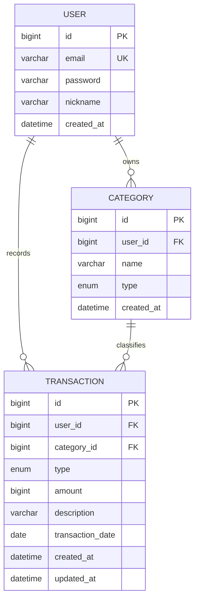

# 머니로그 (MoneyLog)

개인 수입/지출을 기록하고 카테고리별, 월별로 확인하는 가계부 웹 서비스입니다.
멋쟁이사자처럼 백엔드스쿨 캡스톤 과제로 만들었습니다. (도전 과제는 하지 않고 기본 과제만 했습니다)

## 바로가기

- 배포 주소: http://13.125.251.47:8080
- 테스트 계정: `hong@moneylog.com` / `pass1234` (거래내역 5건 있음)
- 비교용 계정: `kim@moneylog.com` / `pass1234` (비어있음 — 남의 데이터가 안 보이는 걸 확인용)
- API 문서(Swagger): http://13.125.251.47:8080/swagger-ui/index.html
- 설계 문서: [요구사항 정의서](docs/requirements.md), [ERD](docs/erd.md), [API 명세서](docs/api-spec.md)
- [회고](docs/retrospective.md)
- [발표 스크립트](docs/presentation-script.md)

## 만든 기능

- 회원가입 / 로그인 (JWT 토큰 발급, 비밀번호는 BCrypt로 저장)
- 카테고리 관리 (가입하면 기본 카테고리 6개가 자동으로 생기고, 추가/수정/삭제 가능)
- 거래내역 등록 / 조회 / 수정 / 삭제
- 이번 달 목록 조회 + 페이징 (타입, 카테고리로 거르는 기능은 못 만들었습니다)
- 월별 통계 (총수입, 총지출, 잔액, 카테고리별 지출)
- 로그인한 사람은 자기 데이터만 볼 수 있게 처리
- 입력값 검증 + 에러 응답 형식 통일

## 사용 기술

| 구분 | 기술 |
|---|---|
| 백엔드 | Java 21, Spring Boot 3.4, Spring Web, Spring Data JPA |
| 인증 | Spring Security, JWT(jjwt), BCrypt |
| DB | H2(로컬), MySQL 8(배포) |
| 문서 | springdoc-openapi (Swagger UI) |
| 프론트 | HTML, CSS, JavaScript (fetch, localStorage) |
| 배포 | Docker, docker-compose, GitHub Actions, AWS EC2 |

## ERD



컬럼 설명이랑 제약조건은 [docs/erd.md](docs/erd.md)에 정리했습니다.

## 실행 방법

### 1) 로컬에서 실행 (H2)

IntelliJ에서 `MoneylogApplication`을 실행하거나 아래 명령을 씁니다.

```bash
./gradlew bootRun
```

포트는 8080이고, H2 콘솔은 `/h2-console`, Swagger는 `/swagger-ui/index.html`에서 볼 수 있습니다.

### 2) 도커로 실행 (MySQL 같이 뜸)

먼저 `.env.example`을 복사해서 `.env`를 만들고 비밀번호 값을 채웁니다.

```bash
cp .env.example .env
docker compose up -d --build
```

앱은 8081 포트, MySQL은 3307 포트로 열립니다.

### 3) 프론트 실행

`frontend/login.html`을 VSCode Live Server로 열면 됩니다.
백엔드 주소는 `frontend/js/config.js`의 `API_BASE`에 적혀 있어서, 주소가 바뀌면 여기를 고치면 됩니다.

## API 목록

| Method | Path | 설명 |
|---|---|---|
| POST | `/api/auth/signup` | 회원가입 |
| POST | `/api/auth/login` | 로그인 (토큰 발급) |
| GET, POST | `/api/categories` | 카테고리 조회 / 추가 |
| PUT, DELETE | `/api/categories/{id}` | 카테고리 수정 / 삭제 |
| GET, POST | `/api/transactions` | 거래내역 월별 조회(페이징) / 등록 |
| GET, PUT, DELETE | `/api/transactions/{id}` | 거래 상세 / 수정 / 삭제 |
| GET | `/api/statistics/monthly?yearMonth=2026-07` | 월별 통계 |

요청/응답 예시는 [docs/api-spec.md](docs/api-spec.md)나 Swagger에서 볼 수 있습니다.

## 폴더 구조

```
src/main/java/org/example/moneylog
├── domain      # 엔티티 (User, Category, Transaction)
├── repository  # JPA Repository
├── service     # 기능 로직
├── controller  # REST API
├── dto         # 요청/응답 객체
├── security    # JWT 토큰, 인증 필터
├── config      # 시큐리티, CORS 설정
└── exception   # 예외 클래스, 전역 예외 처리
```

## 회고 요약

- 잘한 점: 기능 하나 만들 때마다 서버 띄워서 확인하고 넘어간 것
- 막힌 점: springdoc 버전이 안 맞아서 Swagger가 403처럼 보였던 것, EC2에 SSH가 안 붙어서 반나절 날린 것
- 다음에는: 라이브러리 버전 먼저 확인하기, 서버 문제는 서버 로그부터 보기

자세한 내용은 [docs/retrospective.md](docs/retrospective.md)에 썼습니다.

## Git 브랜치 전략

- `main`은 항상 돌아가는 상태로 둡니다.
- 기능별로 `feature/기능이름` 브랜치를 만들어 작업하고 `main`에 합칩니다.
- 커밋 메시지는 `타입: 요약` 형식으로 씁니다. (예: `feat: 거래내역 등록 API 추가`)

## 제출물 체크

- [x] GitHub 저장소: https://github.com/kms1-dev/moneylog
- [x] 배포 URL
- [x] Swagger 문서
- [x] 요구사항 / 설계 문서
- [x] 회고

## 진행 상황

- [x] 1일차: 요구사항, 설계 문서, Git 저장소, 프로젝트 셋업
- [x] 2일차: 카테고리 + 거래내역 CRUD
- [x] 3일차: JWT 인증/인가 + 통계
- [x] 4일차: 프론트 연동 + Docker + EC2 배포
- [x] 5일차: README, 회고 정리
