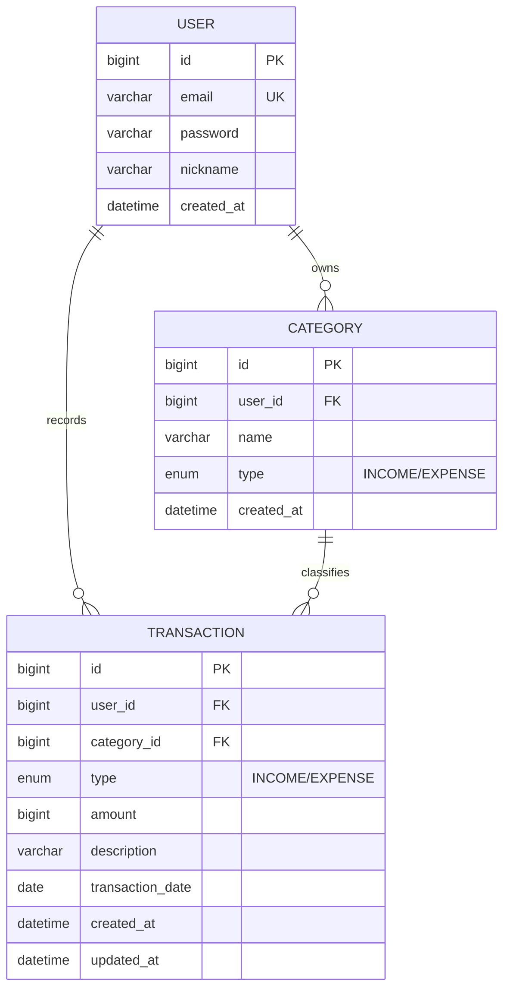

# 머니로그 ERD / 테이블 정의서

도전 과제인 Budget 엔티티는 이번 범위에서 제외합니다.

## 1. 엔티티 목록

- User (사용자)
- Category (카테고리)
- Transaction (거래내역)

관계는 모두 1:N 입니다.

- User 1:N Category (한 사용자가 여러 카테고리를 가진다)
- User 1:N Transaction (한 사용자가 여러 거래를 가진다)
- Category 1:N Transaction (한 카테고리에 여러 거래가 속한다)

## 2. Mermaid ERD



## 3. 테이블 정의서

### users

| 컬럼 | 타입 | 제약 | 설명 |
|---|---|---|---|
| id | BIGINT | PK, AUTO_INCREMENT | 사용자 식별자 |
| email | VARCHAR(255) | NOT NULL, UNIQUE | 로그인 ID |
| password | VARCHAR(255) | NOT NULL | BCrypt 해시 저장 |
| nickname | VARCHAR(50) | NOT NULL | 표시용 이름 |
| created_at | DATETIME | NOT NULL | 가입 시각 |

### categories

| 컬럼 | 타입 | 제약 | 설명 |
|---|---|---|---|
| id | BIGINT | PK, AUTO_INCREMENT | 카테고리 식별자 |
| user_id | BIGINT | FK -> users.id, NOT NULL | 소유 사용자 |
| name | VARCHAR(50) | NOT NULL | 카테고리 이름 |
| type | ENUM('INCOME','EXPENSE') | NOT NULL | 수입/지출 구분 |
| created_at | DATETIME | NOT NULL | 생성 시각 |

가입 시 기본 카테고리(지출: 식비/교통/주거/문화, 수입: 급여/용돈)를 자동 생성합니다.

### transactions

| 컬럼 | 타입 | 제약 | 설명 |
|---|---|---|---|
| id | BIGINT | PK, AUTO_INCREMENT | 거래 식별자 |
| user_id | BIGINT | FK -> users.id, NOT NULL | 기록한 사용자 |
| category_id | BIGINT | FK -> categories.id, NOT NULL | 분류 카테고리 |
| type | ENUM('INCOME','EXPENSE') | NOT NULL | 수입/지출 |
| amount | BIGINT | NOT NULL, > 0 | 금액(원 단위) |
| description | VARCHAR(255) | NULL 허용 | 메모/설명 |
| transaction_date | DATE | NOT NULL | 거래 발생일 |
| created_at | DATETIME | NOT NULL | 등록 시각 |
| updated_at | DATETIME | NOT NULL | 수정 시각 |

## 4. DDL (참고용, 실제로는 JPA가 자동 생성)

```sql
CREATE TABLE users (
    id BIGINT NOT NULL AUTO_INCREMENT,
    email VARCHAR(255) NOT NULL,
    password VARCHAR(255) NOT NULL,
    nickname VARCHAR(50) NOT NULL,
    created_at DATETIME NOT NULL,
    PRIMARY KEY (id),
    UNIQUE KEY uk_users_email (email)
) ENGINE=InnoDB DEFAULT CHARSET=utf8mb4;

CREATE TABLE categories (
    id BIGINT NOT NULL AUTO_INCREMENT,
    user_id BIGINT NOT NULL,
    name VARCHAR(50) NOT NULL,
    type ENUM('INCOME','EXPENSE') NOT NULL,
    created_at DATETIME NOT NULL,
    PRIMARY KEY (id),
    CONSTRAINT fk_categories_user FOREIGN KEY (user_id) REFERENCES users(id)
) ENGINE=InnoDB DEFAULT CHARSET=utf8mb4;

CREATE TABLE transactions (
    id BIGINT NOT NULL AUTO_INCREMENT,
    user_id BIGINT NOT NULL,
    category_id BIGINT NOT NULL,
    type ENUM('INCOME','EXPENSE') NOT NULL,
    amount BIGINT NOT NULL,
    description VARCHAR(255) NULL,
    transaction_date DATE NOT NULL,
    created_at DATETIME NOT NULL,
    updated_at DATETIME NOT NULL,
    PRIMARY KEY (id),
    CONSTRAINT fk_transactions_user FOREIGN KEY (user_id) REFERENCES users(id),
    CONSTRAINT fk_transactions_category FOREIGN KEY (category_id) REFERENCES categories(id),
    KEY idx_tx_user_date (user_id, transaction_date)
) ENGINE=InnoDB DEFAULT CHARSET=utf8mb4;
```

## 5. 설계 메모

- 금액은 `long`(BIGINT), 원 단위 정수로 저장한다.
- `transactionDate`는 `LocalDate`(DATE), `createdAt`/`updatedAt`은 `LocalDateTime`(DATETIME)이다.
- `type`은 `@Enumerated(EnumType.STRING)`으로 문자열 저장한다 (순서로 저장하면 나중에 값이 뒤섞일 수 있음).
- 삭제는 하드 삭제(실제 삭제)로 한다.
